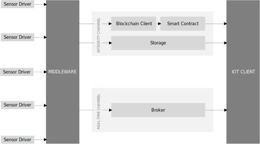

# Enabling the Blockchain in the IoT
This repository contains a middleware for IoT applications. The figure below shows the architecture of the developed application.
The details can be read in the Master thesis "Enabling the Blockchain in the Internet of Things" \[1\].
The basic idea is to distribute data collected by sensors via two communication channels. One guarantees the integrity of the data by storing data in a blockchain. The second channel distributes the data in real-time.

## References

\[1\] [Enabling the Blockchain in the Internet of Things](http://repositum.tuwien.ac.at/obvutwhs/download/pdf/2870057?originalFilename=true)
