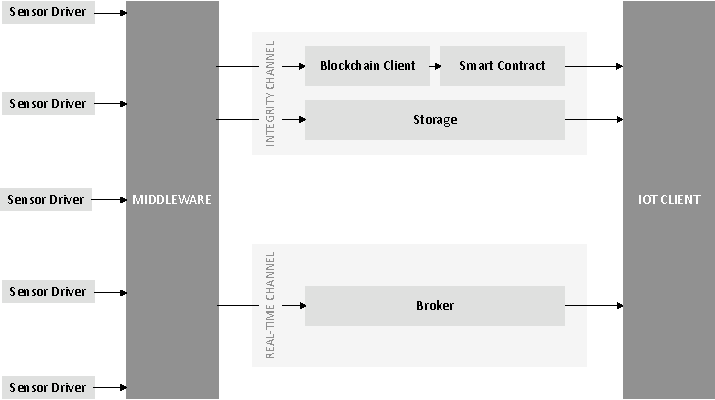

# Enabling the Blockchain in the IoT
This repository contains a middleware for IoT applications. The figure below shows the architecture of the developed 
application. The details can be read in the Master thesis "Enabling the Blockchain in the Internet of Things" \[1\].
The basic idea is to distribute data collected by sensors via two communication channels. One guarantees the integrity of 
the data by storing data in a blockchain. The second channel distributes the data in real-time.

## Usage
The description how to use the required components can be found in the specific sub-folders. This document provides a 
general description which steps you have to take in order to get the application started.

1. Set up the [smart contract](./smart_contract) on the Ethereum blockchain.
2. Set up the [IoT middleware](./iotmiddleware).
3. Set up the [IoT client](./iotclient).
4. Set up the [sensor/virtual driver](./sensor_driver).

##Troubleshooting
**The registration of the sensor/virtual driver at the IoT middleware is not working**  
Check your firewall settings if traffic is blocked from or to the the IoT middleware.

**Transactions in Geth are not sent. Status pending.**
- Try to set a higher gas price. A higher gas price might speed it up.
- Sometimes testnets might have problems in processing transactions. Try to connect to another network, however keep in 
mind different
networks might have different properties like consensus mechanisms.

## References
\[1\] [Enabling the Blockchain in the Internet of Things](http://repositum.tuwien.ac.at/obvutwhs/download/pdf/2870057?originalFilename=true)
